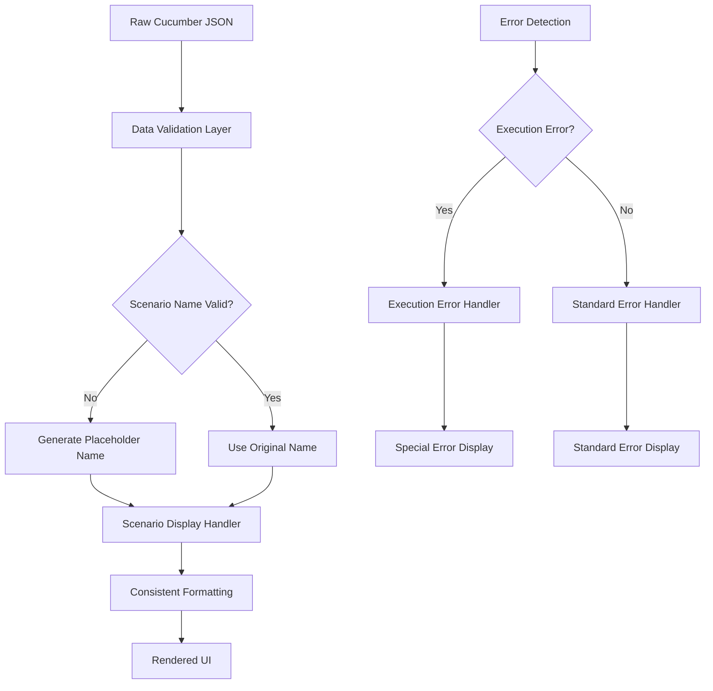

# Design Document: Advanced Cucumber Report Viewer

## Overview

This design document outlines the architecture for a comprehensive, professional Cucumber test report viewer with advanced analytics, filtering, export capabilities, and user experience enhancements. The system will provide accurate test result visualization, performance analytics, error analysis, and integration capabilities for development teams.

## Architecture

The Advanced Cucumber Report Viewer follows a modular, scalable architecture built on Vue.js with the following core layers:

### Frontend Architecture
- **Presentation Layer**: Vue.js components with Vuetify UI framework
- **State Management**: Vuex for application state and data flow
- **Routing**: Vue Router for navigation and deep linking
- **Data Processing**: Custom services for report parsing and analytics

### Core Components
- **ReportViewer.vue**: Main dashboard with filtering, search, and visualization
- **AnalyticsDashboard.vue**: Performance metrics and trend analysis
- **ExportManager.vue**: Multi-format export functionality
- **FilterPanel.vue**: Advanced filtering and search capabilities
- **ErrorAnalyzer.vue**: Detailed error analysis and debugging tools
- **ComparisonView.vue**: Side-by-side test run comparisons
- **SettingsPanel.vue**: User preferences and customization

### Service Layer
- **ReportParser**: Processes Cucumber JSON with validation
- **AnalyticsEngine**: Calculates metrics, trends, and performance data
- **ExportService**: Handles PDF, HTML, JSON export generation
- **FilterService**: Advanced filtering logic with query optimization
- **APIService**: REST API integration for CI/CD and external tools

## Components and Interfaces

### Core Dashboard Components

#### ReportViewer.vue (Enhanced)
- **Clean Tag Display**: Automatic removal of curly braces from tags for professional appearance
- **Left-Aligned Content**: Consistent left alignment for all test content including scenarios, steps, features, and summaries
- **Multi-format Report Support**: JSON, XML, Allure format parsing
- **Advanced Filtering**: Status, tags, duration, date range, custom queries
- **Real-time Search**: Full-text search with highlighting and result counts
- **Interactive Visualizations**: Charts, graphs, and performance heatmaps
- **Export Integration**: PDF, HTML, JSON export with custom templates

#### AnalyticsDashboard.vue
- **Trend Analysis**: Pass/fail rates over time with configurable date ranges
- **Performance Metrics**: Execution time analysis with percentile statistics
- **Flaky Test Detection**: Identifies inconsistent test results across runs
- **Coverage Analysis**: Tag-based test coverage visualization
- **Regression Detection**: Automated alerts for performance degradations

#### ExportManager.vue
- **Multi-format Export**: PDF with charts, standalone HTML, structured JSON
- **Custom Templates**: Configurable report layouts and branding
- **Batch Processing**: Export multiple reports or filtered datasets
- **Scheduled Exports**: Automated report generation and distribution
- **Metadata Inclusion**: Export timestamps, filter criteria, and user context

#### FilterPanel.vue
- **Advanced Query Builder**: Visual interface for complex filter combinations
- **Saved Filters**: User-defined filter presets with sharing capabilities
- **URL State Management**: Shareable links with filter state preservation
- **Real-time Filtering**: Instant results with debounced search
- **Filter Analytics**: Usage statistics and optimization suggestions

#### ErrorAnalyzer.vue
- **Stack Trace Visualization**: Syntax-highlighted error displays
- **Error Grouping**: Similar errors clustered with occurrence counts
- **Screenshot Integration**: Embedded test failure screenshots
- **Debug Context**: Before/after state information for failed steps
- **Error Trends**: Historical error analysis and pattern recognition

#### ComparisonView.vue
- **Side-by-side Comparison**: Detailed diff views between test runs
- **Change Highlighting**: Visual indicators for new failures and fixes
- **Baseline Comparison**: Compare against previous releases or stable builds
- **Regression Analysis**: Automated detection of test quality changes
- **Progress Tracking**: Improvement/degradation metrics over time

#### CustomizableDashboard.vue
- **Widget-based Layout**: Drag-and-drop dashboard customization with resizable widgets
- **Configurable Metrics**: Custom threshold settings and alert configurations
- **Multiple Layouts**: Save/load different dashboard configurations for teams and individuals
- **User Preferences**: Persistent theme selection, layout preferences, and default views
- **Team Collaboration**: Shared dashboard configurations with role-based access

#### ResponsiveLayout.vue
- **Mobile-first Design**: Adaptive layouts optimized for all screen sizes
- **Touch Interactions**: Gesture support and touch-friendly interface elements
- **Progressive Enhancement**: Core functionality accessible without JavaScript
- **Accessibility Compliance**: WCAG 2.1 AA standards with screen reader support

## Data Models

### Enhanced Data Structures

#### ReportData Model
```typescript
interface ReportData {
  features: Feature[];
  metadata: ReportMetadata;
  analytics: AnalyticsData;
  comparisons?: ComparisonData[];
}

interface ReportMetadata {
  timestamp: Date;
  environment: string;
  tool: string;
  version: string;
  duration: number;
  tags: string[];
}

interface AnalyticsData {
  trends: TrendData[];
  performance: PerformanceMetrics;
  flaky: FlakyTestData[];
  coverage: CoverageMetrics;
}
```

#### Filter and Search Models
```typescript
interface FilterCriteria {
  status: string[];
  tags: string[];
  dateRange: DateRange;
  duration: DurationFilter;
  customQuery: string;
  logicalOperator: 'AND' | 'OR';
}

interface SearchResult {
  total: number;
  features: number;
  scenarios: number;
  steps: number;
  matches: SearchMatch[];
}

interface SavedFilter {
  id: string;
  name: string;
  criteria: FilterCriteria;
  isShared: boolean;
  createdBy: string;
  createdAt: Date;
}
```

#### Display and Formatting Models
```typescript
interface DisplaySettings {
  alignment: 'left' | 'center' | 'right';
  tagFormat: {
    removeBraces: boolean;
    separator: string;
    styling: TagStyle;
  };
  theme: 'light' | 'dark' | 'high-contrast';
  compactMode: boolean;
}

interface TagStyle {
  backgroundColor: string;
  textColor: string;
  borderRadius: number;
  padding: string;
}
```

#### Dashboard and Widget Models
```typescript
interface DashboardConfig {
  id: string;
  name: string;
  layout: WidgetLayout[];
  isDefault: boolean;
  isShared: boolean;
  permissions: string[];
}

interface WidgetLayout {
  id: string;
  type: 'chart' | 'metric' | 'table' | 'filter';
  position: { x: number; y: number };
  size: { width: number; height: number };
  config: WidgetConfig;
}

interface PerformanceMetrics {
  executionTimes: ExecutionTimeData[];
  bottlenecks: BottleneckData[];
  trends: TrendData[];
  percentiles: PercentileData;
  regressions: RegressionAlert[];
}
```

## Implementation Details

### Core Feature Enhancements

#### 1. Advanced Analytics Engine
```javascript
class AnalyticsEngine {
  calculateTrends(reports) {
    // Analyze pass/fail rates over time
    // Detect performance regressions
    // Identify flaky test patterns
  }
  
  generatePerformanceMetrics(data) {
    // Calculate percentile statistics
    // Create execution time heatmaps
    // Identify bottlenecks
  }
}
```

#### 2. Export Service Implementation
```javascript
class ExportService {
  exportToPDF(data, template) {
    // Generate PDF with charts and formatting
    // Include metadata and filter criteria
    // Support custom branding
  }
  
  exportToHTML(data, options) {
    // Create standalone HTML file
    // Embed styles and scripts
    // Maintain interactivity
  }
}
```

#### 3. Advanced Filtering System
```javascript
class FilterService {
  buildQuery(criteria) {
    // Support AND/OR logic combinations
    // Handle complex nested queries
    // Optimize for performance
  }
  
  saveFilter(name, criteria) {
    // Store user-defined presets
    // Enable sharing capabilities
    // Maintain filter history
  }
}
```

#### 4. Enhanced Error Analysis and Failed Scenario Display
```javascript
class ErrorAnalyzer {
  groupSimilarErrors(errors) {
    // Cluster errors by similarity
    // Count occurrences
    // Identify patterns
  }
  
  analyzeStackTrace(trace) {
    // Syntax highlighting
    // Extract relevant information
    // Link to source code
  }
  
  extractFailedStepDetails(step) {
    // Extract error message from step.result.error_message
    // Truncate to first 3 lines for preview
    // Provide expandable full error view
    // Parse stack trace for debugging information
  }
  
  extractScreenshots(scenario) {
    // Extract base64 screenshot data from scenario.after[].embeddings[]
    // Convert base64 to displayable image format
    // Associate screenshots with failed steps
    // Provide modal/gallery view for screenshots
  }
  
  formatErrorPreview(errorMessage) {
    // Show first 3 lines of error message
    // Add "..." indicator for truncated content
    // Provide click handler for full error expansion
  }
  
  handleMalformedScenarios(scenario) {
    // Generate placeholder names for empty scenario names
    // Handle scenarios with missing or null data
    // Ensure all failed scenarios are visible regardless of data quality
    // Mark scenarios with data integrity issues
  }
  
  processExecutionErrorFeatures(feature) {
    // Detect classpath:io/cucumber/core/failure.feature
    // Display execution errors as special framework error section
    // Handle IllegalArgumentException and similar framework errors
    // Provide guidance for resolving execution-level issues
  }
}
```

#### 4.1. Failed Scenario Display Handler
```javascript
class FailedScenarioDisplayHandler {
  constructor() {
    this.placeholderNames = new Map();
    this.dataIssueFlags = new Set();
  }
  
  normalizeScenarioName(scenario) {
    // Generate meaningful names for empty or null scenario names
    // Use scenario ID or step information to create descriptive names
    // Format: "Unnamed Scenario (ID: scenario-id)" or "Scenario with [step count] steps"
    if (!scenario.name || scenario.name.trim() === '') {
      return this.generatePlaceholderName(scenario);
    }
    return scenario.name;
  }
  
  generatePlaceholderName(scenario) {
    // Create descriptive placeholder based on available data
    if (scenario.id) {
      return `Unnamed Scenario (${scenario.id.split(';').pop() || 'unknown'})`;
    }
    if (scenario.steps && scenario.steps.length > 0) {
      return `Scenario with ${scenario.steps.length} steps`;
    }
    return 'Unnamed Scenario';
  }
  
  validateScenarioData(scenario) {
    // Check for data integrity issues
    // Flag scenarios with missing critical information
    // Return validation status and issues found
    const issues = [];
    
    if (!scenario.name || scenario.name.trim() === '') {
      issues.push('empty_name');
    }
    if (!scenario.steps || scenario.steps.length === 0) {
      issues.push('no_steps');
    }
    if (scenario.steps && scenario.steps.some(step => !step.result)) {
      issues.push('missing_results');
    }
    
    return {
      isValid: issues.length === 0,
      issues: issues,
      severity: issues.length > 2 ? 'high' : issues.length > 0 ? 'medium' : 'low'
    };
  }
  
  renderScenarioWithIssues(scenario, validation) {
    // Display scenario with data quality indicators
    // Show warning icons for data issues
    // Provide tooltips explaining the problems
    // Ensure scenario is still expandable and functional
  }
}
```

#### 4.2. Execution Error Feature Handler
```javascript
class ExecutionErrorFeatureHandler {
  constructor() {
    this.executionErrorPatterns = [
      'classpath:io/cucumber/core/failure.feature',
      'failure.feature',
      'execution-error'
    ];
  }
  
  isExecutionErrorFeature(feature) {
    // Detect Cucumber framework error features
    return this.executionErrorPatterns.some(pattern => 
      feature.uri && feature.uri.includes(pattern)
    );
  }
  
  renderExecutionErrorFeature(feature) {
    // Display execution errors with special styling
    // Use distinct visual indicators (warning colors, icons)
    // Show "Framework Execution Error" label
    // Display error details prominently
    return {
      type: 'execution-error',
      title: 'Test Execution Error',
      description: feature.description || 'There were errors during the execution',
      severity: 'critical',
      guidance: this.getExecutionErrorGuidance(feature)
    };
  }
  
  getExecutionErrorGuidance(feature) {
    // Provide specific guidance based on error type
    const scenarios = feature.elements || [];
    const errorScenarios = scenarios.filter(s => 
      s.steps && s.steps.some(step => 
        step.result && step.result.status === 'failed'
      )
    );
    
    if (errorScenarios.length > 0) {
      const firstError = errorScenarios[0].steps.find(step => 
        step.result && step.result.status === 'failed'
      );
      
      if (firstError && firstError.result.error_message) {
        const errorMessage = firstError.result.error_message;
        
        if (errorMessage.includes('Test name must not be null or empty')) {
          return {
            issue: 'Empty test names detected',
            solution: 'Ensure all scenarios have meaningful names in your feature files',
            action: 'Review your Cucumber feature files and add names to all scenarios'
          };
        }
        
        if (errorMessage.includes('IllegalArgumentException')) {
          return {
            issue: 'Invalid test configuration',
            solution: 'Check your test runner configuration and step definitions',
            action: 'Review test setup and ensure all required parameters are provided'
          };
        }
      }
    }
    
    return {
      issue: 'Test execution framework error',
      solution: 'Check Cucumber configuration and test setup',
      action: 'Review logs and test runner configuration for detailed error information'
    };
  }
}
```

#### 4.3. Consistent Display Formatter
```javascript
class ConsistentDisplayFormatter {
  constructor() {
    this.displaySettings = {
      alignment: 'left',
      tagFormat: {
        removeBraces: true,
        separator: ' ',
        styling: {
          backgroundColor: '#e3f2fd',
          textColor: '#1976d2',
          borderRadius: '4px',
          padding: '2px 8px'
        }
      }
    };
  }
  
  formatFeatureDisplay(feature, metadata = {}) {
    // Apply consistent formatting regardless of feature type
    const isExecutionError = metadata.isExecutionError || false;
    const hasDataIssues = metadata.hasDataIssues || false;
    
    return {
      name: this.formatFeatureName(feature, isExecutionError),
      description: this.formatDescription(feature.description),
      scenarios: this.formatScenarios(feature.elements || [], hasDataIssues),
      tags: this.formatTags(feature.tags || []),
      styling: this.getFeatureStyling(isExecutionError, hasDataIssues)
    };
  }
  
  formatFeatureName(feature, isExecutionError) {
    if (isExecutionError) {
      return `⚠️ ${feature.name || 'Test Execution Error'}`;
    }
    return feature.name || 'Unnamed Feature';
  }
  
  formatScenarios(scenarios, hasDataIssues) {
    return scenarios.map(scenario => {
      const validation = this.validateScenarioData(scenario);
      
      return {
        name: this.normalizeScenarioName(scenario),
        status: this.calculateScenarioStatus(scenario),
        steps: this.formatSteps(scenario.steps || []),
        tags: this.formatTags(scenario.tags || []),
        dataQuality: validation,
        styling: this.getScenarioStyling(scenario, validation)
      };
    });
  }
  
  formatTags(tags) {
    // Remove curly braces and apply consistent styling
    return tags.map(tag => ({
      name: tag.name ? tag.name.replace(/[{}]/g, '') : '',
      styling: this.displaySettings.tagFormat.styling
    }));
  }
  
  getFeatureStyling(isExecutionError, hasDataIssues) {
    if (isExecutionError) {
      return {
        borderLeft: '4px solid #f44336',
        backgroundColor: '#ffebee',
        icon: 'mdi-alert-circle'
      };
    }
    
    if (hasDataIssues) {
      return {
        borderLeft: '4px solid #ff9800',
        backgroundColor: '#fff3e0',
        icon: 'mdi-alert'
      };
    }
    
    return {
      borderLeft: '4px solid #4caf50',
      backgroundColor: '#f1f8e9',
      icon: 'mdi-check-circle'
    };
  }
  
  getScenarioStyling(scenario, validation) {
    const baseStyle = {
      textAlign: 'left',
      padding: '8px 16px',
      marginBottom: '4px'
    };
    
    if (!validation.isValid) {
      return {
        ...baseStyle,
        borderLeft: '2px solid #ff9800',
        backgroundColor: '#fff8e1'
      };
    }
    
    const status = this.calculateScenarioStatus(scenario);
    const statusColors = {
      passed: '#4caf50',
      failed: '#f44336',
      skipped: '#ff9800',
      unknown: '#9e9e9e'
    };
    
    return {
      ...baseStyle,
      borderLeft: `2px solid ${statusColors[status] || statusColors.unknown}`
    };
  }
}
```

#### 4.1. Failed Step Error Display Component
```javascript
class FailedStepErrorDisplay {
  constructor() {
    this.maxPreviewLines = 3;
    this.expandedSteps = new Set();
  }
  
  renderErrorPreview(step) {
    // Display first 3 lines of error message
    // Show "..." with click handler to expand
    // Highlight error type and key information
  }
  
  toggleErrorExpansion(stepId) {
    // Toggle between preview and full error display
    // Maintain expansion state per step
    // Smooth animation for expand/collapse
  }
  
  renderFullError(errorMessage) {
    // Display complete error message with syntax highlighting
    // Format stack trace for readability
    // Provide copy-to-clipboard functionality
  }
}
```

#### 4.2. Screenshot Display Component
```javascript
class ScreenshotDisplay {
  extractScreenshotFromEmbeddings(embeddings) {
    // Find image/png embeddings in scenario.after hooks
    // Convert base64 data to blob URL
    // Handle multiple screenshots per scenario
  }
  
  renderScreenshotThumbnail(screenshotData) {
    // Display small thumbnail next to failed step
    // Provide click handler to open full-size modal
    // Show loading state while processing base64 data
  }
  
  openScreenshotModal(screenshots) {
    // Display full-size screenshot in modal overlay
    // Support navigation between multiple screenshots
    // Provide zoom and download functionality
  }
  
  associateScreenshotWithStep(scenario, stepIndex) {
    // Link screenshots from after hooks to specific failed steps
    // Handle timing-based association
    // Provide fallback for scenario-level screenshots
  }
}
```

#### 5. Comparison Engine
```javascript
class ComparisonEngine {
  compareReports(baseline, current) {
    // Generate diff views
    // Highlight changes
    // Calculate regression metrics
  }
  
  trackProgress(reports) {
    // Monitor improvement trends
    // Alert on degradations
    // Provide insights
  }
}
```

#### 6. Display Formatting Service
```javascript
class DisplayFormattingService {
  cleanTags(tags) {
    // Remove curly braces from tag display
    // Apply consistent tag styling
    // Handle special characters and formatting
  }
  
  applyLeftAlignment(content) {
    // Ensure consistent left alignment for all content
    // Handle multi-line content formatting
    // Maintain visual hierarchy
  }
  
  formatTestResults(results) {
    // Apply consistent formatting across all test sections
    // Handle status indicators and visual cues
    // Ensure professional appearance
  }
}
```

#### 7. API Integration Service
```javascript
class APIService {
  uploadReport(reportData) {
    // Handle report upload to CI/CD systems
    // Support authentication and rate limiting
    // Provide upload progress and error handling
  }
  
  configureWebhooks(config) {
    // Set up webhook integrations for test completion events
    // Support multiple notification channels
    // Handle webhook authentication and validation
  }
  
  integrateExternalTools(toolConfig) {
    // Support JUnit XML and Allure format integration
    // Handle JIRA ticket linking and issue tracking
    // Provide Slack/Teams notification capabilities
  }
}
```

#### 8. Dashboard Customization Service
```javascript
class DashboardService {
  createCustomLayout(config) {
    // Enable drag-and-drop widget arrangement
    // Support resizable dashboard components
    // Handle layout persistence and sharing
  }
  
  manageUserPreferences(preferences) {
    // Store theme selection and layout preferences
    // Handle default view configuration
    // Support team-level and personal configurations
  }
  
  configureMetrics(thresholds) {
    // Set custom threshold settings and alerts
    // Handle configurable performance metrics
    // Provide automated notification rules
  }
}
```

### User Experience Enhancements

#### Responsive Design
- **Mobile-first approach**: Optimized layouts for all screen sizes
- **Touch-friendly interfaces**: Gesture support for mobile devices
- **Progressive enhancement**: Core functionality works without JavaScript

#### Accessibility Features
- **WCAG 2.1 AA compliance**: Screen reader support and keyboard navigation
- **High contrast modes**: Accessible color schemes for visual impairments
- **Semantic HTML**: Proper heading structure and ARIA labels

#### Performance Optimization
- **Lazy loading**: Load components and data on demand
- **Virtual scrolling**: Handle large datasets efficiently
- **Caching strategies**: Minimize API calls and improve response times

## Error Handling

### Comprehensive Error Management Strategy

#### Data Processing Errors
- **Invalid JSON Handling**: Graceful degradation with user-friendly error messages
- **Schema Validation**: Validate Cucumber JSON structure and provide specific feedback
- **Large Dataset Protection**: Memory management and performance safeguards
- **Network Failures**: Retry mechanisms and offline capability

#### User Interface Errors
- **Component Error Boundaries**: Prevent cascading failures in Vue components
- **State Management Errors**: Vuex error handling with rollback capabilities
- **Export Failures**: Detailed error reporting for PDF/HTML generation issues
- **Filter Query Errors**: Validation and suggestion for invalid filter expressions

#### Integration Errors
- **API Failures**: Comprehensive error handling for CI/CD integrations
- **Authentication Issues**: Clear messaging for access control problems
- **Rate Limiting**: Graceful handling of API throttling
- **Version Compatibility**: Support for different Cucumber JSON versions

## Specific Issue Resolution Design

### Register Feature Display Issues

The register feature display problems stem from scenarios with empty names and malformed data. The solution involves:

#### Problem Analysis
- **Empty Scenario Names**: Scenarios with `"name": ""` or `null` names cause display issues
- **IllegalArgumentException**: Framework errors like "Test name must not be null or empty" break normal processing
- **Inconsistent Data**: Some scenarios have complete data while others are missing critical information

#### Solution Architecture


#### Implementation Strategy
1. **Pre-processing Layer**: Validate and normalize all scenario data before display
2. **Placeholder Generation**: Create meaningful names for unnamed scenarios
3. **Error Classification**: Distinguish between test failures and execution errors
4. **Consistent Rendering**: Apply uniform styling regardless of data quality

### Execution Error Feature Handling

The `classpath:io/cucumber/core/failure.feature` represents Cucumber framework execution errors, not test failures.

#### Design Approach
- **Special Detection**: Identify execution error features by URI pattern
- **Distinct Styling**: Use warning colors and icons to differentiate from test failures
- **Error Guidance**: Provide specific resolution steps for common execution errors
- **Framework Context**: Clearly indicate these are framework issues, not test logic problems

#### Visual Design
```css
.execution-error-feature {
  border-left: 4px solid #f44336;
  background-color: #ffebee;
  margin-bottom: 16px;
}

.execution-error-header {
  display: flex;
  align-items: center;
  padding: 12px 16px;
  background-color: #ffcdd2;
}

.execution-error-icon {
  color: #f44336;
  margin-right: 8px;
}

.execution-error-guidance {
  padding: 16px;
  background-color: #fff3e0;
  border-left: 3px solid #ff9800;
  margin-top: 8px;
}
```

### Data Quality Management

#### Validation Pipeline
```javascript
class DataQualityManager {
  validateReport(reportData) {
    const issues = [];
    
    reportData.forEach((feature, featureIndex) => {
      // Validate feature structure
      if (!feature.name) {
        issues.push({
          type: 'missing_feature_name',
          location: `Feature ${featureIndex}`,
          severity: 'medium'
        });
      }
      
      // Validate scenarios
      if (feature.elements) {
        feature.elements.forEach((scenario, scenarioIndex) => {
          if (scenario.type !== 'background') {
            const scenarioIssues = this.validateScenario(scenario);
            issues.push(...scenarioIssues.map(issue => ({
              ...issue,
              location: `Feature ${featureIndex}, Scenario ${scenarioIndex}`
            })));
          }
        });
      }
    });
    
    return {
      isValid: issues.length === 0,
      issues: issues,
      summary: this.generateValidationSummary(issues)
    };
  }
  
  validateScenario(scenario) {
    const issues = [];
    
    if (!scenario.name || scenario.name.trim() === '') {
      issues.push({
        type: 'empty_scenario_name',
        severity: 'high',
        suggestion: 'Generate placeholder name from scenario ID or steps'
      });
    }
    
    if (!scenario.steps || scenario.steps.length === 0) {
      issues.push({
        type: 'no_steps',
        severity: 'high',
        suggestion: 'Scenario should have at least one step'
      });
    }
    
    return issues;
  }
}
```

#### Recovery Strategies
1. **Graceful Degradation**: Display available information even when data is incomplete
2. **Smart Defaults**: Generate meaningful placeholders for missing data
3. **User Feedback**: Clearly indicate data quality issues without breaking functionality
4. **Progressive Enhancement**: Show basic information first, then enhance with additional details

## Testing Strategy

### Comprehensive Testing Approach

#### 1. Unit Testing
- **Component Testing**: Vue Test Utils for all UI components
- **Service Testing**: Jest tests for analytics, export, and filter services
- **Utility Testing**: Pure function testing for data processing
- **Error Scenario Testing**: Comprehensive error condition coverage

#### 2. Integration Testing
- **API Integration**: Mock server testing for CI/CD endpoints
- **Export Integration**: PDF/HTML generation validation
- **Filter Integration**: Complex query processing verification
- **State Management**: Vuex store integration testing

#### 3. End-to-End Testing
- **User Workflows**: Cypress tests for complete user journeys
- **Cross-browser Testing**: Automated testing across Chrome, Firefox, Safari, Edge
- **Mobile Testing**: Responsive design validation on various devices
- **Performance Testing**: Load testing with large datasets

#### 4. Accessibility Testing
- **Screen Reader Testing**: NVDA, JAWS, VoiceOver compatibility
- **Keyboard Navigation**: Tab order and focus management
- **Color Contrast**: WCAG 2.1 AA compliance verification
- **Semantic HTML**: Proper heading structure and ARIA labels

#### 5. Performance Testing
- **Load Testing**: Large report handling (1000+ scenarios)
- **Memory Testing**: Memory leak detection and optimization
- **Rendering Performance**: Virtual scrolling and lazy loading validation
- **Export Performance**: PDF/HTML generation speed optimization

#### 6. Security Testing
- **XSS Prevention**: Input sanitization and output encoding
- **CSRF Protection**: Token validation for API calls
- **Data Privacy**: Sensitive information handling
- **Authentication**: Secure session management

## Testing Strategy

### Test Data Requirements
- **Small Reports**: 10-50 scenarios for basic functionality
- **Medium Reports**: 100-500 scenarios for performance testing
- **Large Reports**: 1000+ scenarios for stress testing
- **Edge Cases**: Malformed JSON, missing fields, unusual characters
- **Historical Data**: Multiple report versions for trend analysis

### Automated Testing Pipeline
- **Pre-commit Hooks**: Linting, unit tests, and basic validation
- **CI/CD Integration**: Automated testing on pull requests
- **Nightly Testing**: Comprehensive test suite execution
- **Performance Monitoring**: Continuous performance regression detection